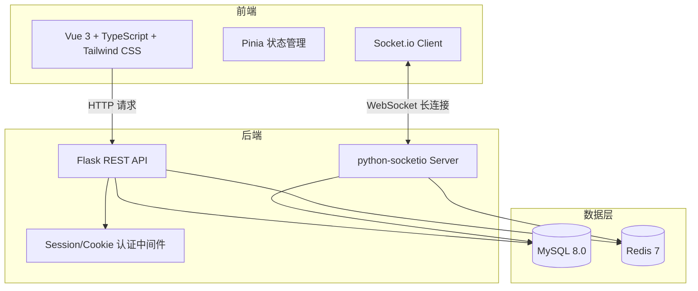
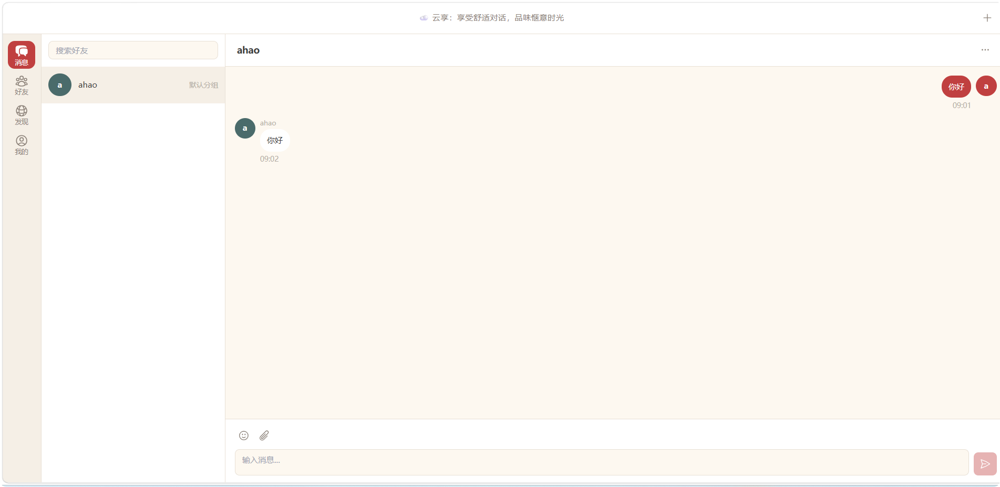
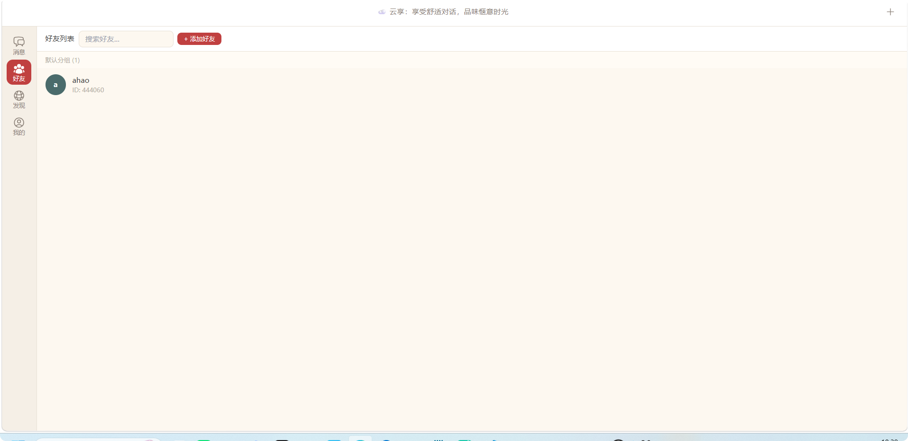
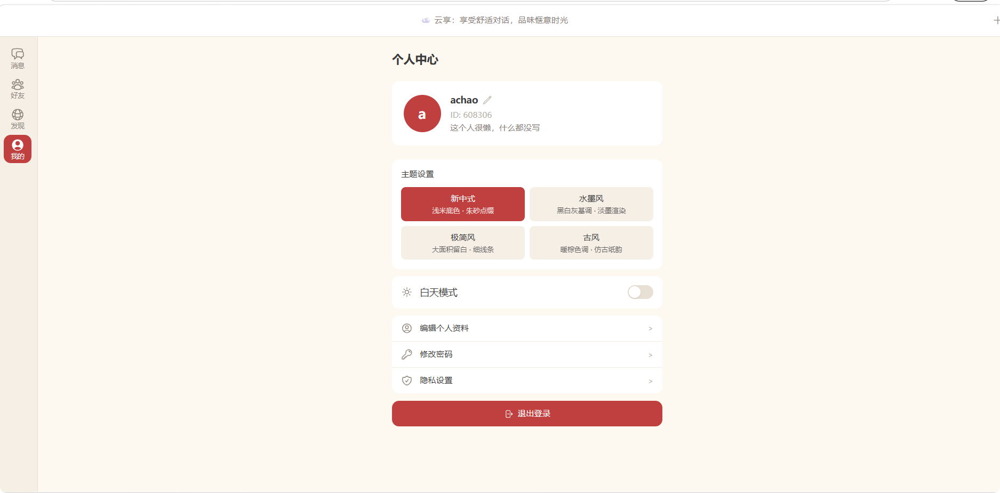
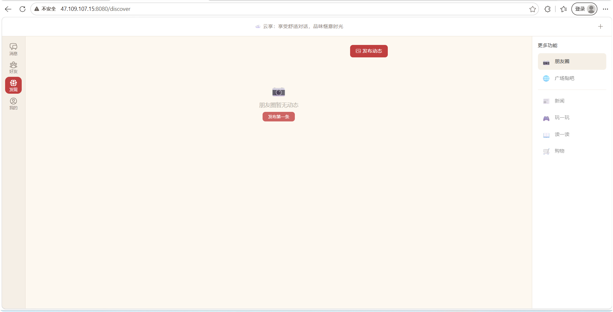

## 一、项目概览与架构

这是一个**新中式风格的即时通讯 Web 应用**，参考了微信桌面版的交互布局，支持一对一聊天、群聊、朋友圈、多主题切换等功能。整体架构分为三层：



> 💡 **关于 AI 辅助开发**：在正式开始之前想先说明一点——这个项目中用到的很多技术（比如 TypeScript、Tailwind CSS、Redis），我在项目开始前其实并不熟悉，甚至完全没接触过。在整个开发过程中，我大量借助了 AI 编程助手来理解这些技术的概念、生成代码框架、排查错误。后面每个技术点我都会穿插分享 AI 是怎么帮到我的。

---

## 二、技术栈详解：每个技术分别干了什么活

### 2.1 Vue 3 + TypeScript —— 前端界面的骨架

**它是什么**：Vue 3 是一个前端框架，用来构建网页的交互界面；TypeScript 是 JavaScript 的超集，给 JS 加上"类型标注"，让代码更严谨。

**在这个项目里干了什么**：整个网站所有你能看到、能点击的界面都是由 Vue 3 搭建的。比如登录页的表单、聊天列表的滚动加载、消息气泡的排列、朋友圈时间线等等。Vue 的**组件化**思想让我能把界面拆成一个个独立的小块（比如"消息气泡"就是一个组件，"好友列表项"又是一个组件），修改其中一块不会影响其他部分。

**TypeScript 的作用**：定义了消息、用户、好友等数据的"形状"。比如一条消息必须包含 `sender_id`（发送者）、`content`（内容）、`content_type`（文字还是图片）等字段。如果写代码时漏了字段或者类型写错了，TypeScript 会在编译时就报错，不用等到浏览器里运行才发现。

> 🤖 **AI 帮了我什么**：说实话，我之前只会写 JavaScript，对 TypeScript 的泛型、接口、类型推导一窍不通。AI 帮我生成了项目中所有的 TypeScript 类型定义（`types/` 目录），比如消息接口 `Message`、用户接口 `User`。我只需要用自然语言描述"一条消息应该有哪些字段"，AI 就能给出完整的类型定义。遇到类型报错时，把错误信息贴给 AI，它也能解释清楚哪里不对、怎么改。

### 2.2 Tailwind CSS —— 样式的"积木"

**它是什么**：Tailwind CSS 是一种"原子化 CSS"框架。不同于传统的写 CSS 类名（比如 `.chat-bubble`），Tailwind 提供了成千上万个短小的工具类（比如 `bg-white` = 白色背景，`rounded-xl` = 大圆角，`shadow-md` = 中等阴影），直接在 HTML 标签上组合使用。

**在这个项目里干了什么**：负责整个网站的外观——消息气泡的圆角和阴影、导航栏的颜色和宽度、朋友圈卡片的间距等等。最大的亮点是**主题切换**：我定义了三套配色方案（水墨风/极简风/古风），每套都是一组 CSS 变量，Tailwind 能无缝对接这些变量，切换主题时所有颜色瞬间刷新，不需要刷新页面。

> Tailwind 有几百个工具类名，我一开始根本记不住。实际做法是：我告诉 AI "我要一个左对齐、浅灰背景、16px 圆角、带轻微阴影的消息气泡"，AI 直接输出 `bg-gray-100 rounded-2xl shadow-bubble px-4 py-2`。用多了之后自然也记住了常用的类名。三套主题的色板变量也是 AI 帮我配置的——我描述每种风格的色彩感觉（比如"水墨风就是黑白灰为主，偶点缀淡墨"），AI 给出具体的颜色值。

### 2.3 Pinia —— 数据的"中转站"

**它是什么**：Pinia 是 Vue 3 官方推荐的状态管理库。通俗地说，它是一个全局的数据仓库，不同的页面和组件都能从这里读取和修改数据。

**在这个项目里干了什么**：管理三类核心数据：
- **用户状态**（`auth store`）：当前登录用户的信息、登录/登出操作
- **聊天状态**（`chat store`）：消息列表、未读计数、当前聊天对象
- **主题状态**（`theme store`）：当前使用的主题、日夜间模式

举个例子：当你在聊天界面收到一条新消息，Socket.io 把消息推送到浏览器后，消息会被存入 Pinia 的 chat store，然后聊天窗口和左侧消息列表**同时刷新**——因为两个组件都从同一个 store 读取数据。

### 2.4 Flask —— 后端的"大脑"

**它是什么**：Flask 是一个轻量级的 Python Web 框架，用来写服务端 API（应用程序接口）。

**在这个项目里干了什么**：所有业务逻辑都跑在 Flask 上。具体包括：
- **路由处理**：接收前端的 HTTP 请求（比如"给我好友列表"、"我要发一条消息"），找到对应的处理函数
- **数据验证**：检查请求参数是否合法（比如注册时用户名不能为空、密码长度要够）
- **数据库操作**：通过 SQLAlchemy ORM 读写 MySQL 数据库
- **权限校验**：每个请求都要验证用户是否登录、是否有权操作这个资源（详见安全章节）

Flask 的 API 都遵循 RESTful 风格，比如 `GET /api/v1/friends` 获取好友列表，`POST /api/v1/messages` 发送消息。

### 2.5 Socket.io —— 消息的"高速公路"

**它是什么**：Socket.io 是一个实时双向通信库。不同于普通的 HTTP（客户端问一句，服务端答一句），Socket.io 在浏览器和服务器之间建立一条**持久连接**（WebSocket），双方随时可以向对方推送数据。

**在这个项目里干了什么**：这是整个项目最核心的技术，负责：
- **实时消息推送**：A 发消息 → 服务器收到 → 服务器立刻推给 B，延迟通常不到 100 毫秒
- **撤回通知**：A 撤回消息 → 服务器标记消息为已撤回 → 实时通知 B 更新聊天窗口
- **好友申请通知**：有人加你好友 → 服务器推送通知 → 你的界面上弹出红点提示
- **在线状态**：好友上线/下线 → 服务器向所有相关好友广播状态变更
- **群聊广播**：利用 Room 机制，每个群就是一个房间，消息只推送到房间内的成员

> Socket.io 的配置涉及前后端两端——前端要写 `socket.io-client` 的连接代码，后端要写 `python-socketio` 的事件处理函数，还有跨域配置、房间管理、断线重连等。这些概念对我一个新手来说非常复杂。AI 帮我梳理了完整的事件流程图：前端 emit 什么事件 → 后端怎么接收 → 后端 emit 什么事件回去 → 前端怎么处理。具体代码也是 AI 生成框架后我再调整的。

### 2.6 MySQL + Redis —— 数据的"仓库"和"缓存"

**MySQL 是什么**：关系型数据库，数据以表格形式存储，不同表之间通过外键建立关联。

**在这个项目里干了什么**：持久化存储所有数据——用户信息、好友关系、每一条聊天记录、朋友圈动态、点赞评论等等。即使服务器重启，数据也不会丢失。设计了 10 张表，关键索引确保了查询效率（比如拉取聊天记录时用 `(receiver_id, sender_id, created_at)` 联合索引加速）。

**Redis 是什么**：内存数据库，数据存在内存里（而不是硬盘），读写速度极快，适合做缓存。

**在这个项目里干了什么**：
- **未读消息计数**：每个用户的未读消息数存在 Redis 里，好友发消息时 `+1`，用户点开聊天时清零。因为更新频繁，用 Redis 比每次查 MySQL 快得多
- **在线状态**：用户登录后在 Redis 里标记"在线"，下线后清除。好友列表里那个小绿点就是这样实现的
- **Session 缓存**：用户登录后的 Session 数据存 Redis，服务器重启不会让所有用户掉线

> Redis 我真的是零基础。MySQL 我在课上还学过一点，但 Redis 完全没接触过。AI 帮我回答了"为什么聊天系统需要 Redis"——它举了未读红点的例子：如果用 MySQL，每次新消息都要 UPDATE 一个未读计数字段，高并发下表锁会成为瓶颈；用 Redis 的 `INCR` 命令，原子操作，性能高几个数量级。Redis 的连接配置、数据过期策略、Session 序列化方案，基本都是 AI 帮我设计好我再理解消化的。

---

## 三、核心功能实现

### 3.1 账户系统

注册登录使用 **Session/Cookie** 机制：用户登录后服务端生成一个 Session 存入 Redis，浏览器保存对应的 Cookie。之后每次请求自动带上 Cookie，服务端通过它识别用户身份。

密码用 `bcrypt` 算法哈希后存入 MySQL——这是一种"单向"加密，即使数据库泄露，攻击者也无法反推出原始密码。

> 💡 **Session vs JWT**：聊天应用里服务端需要实时知道"谁在线"，Session 存在 Redis 里，服务端随时可查可删，踢人下线、强制登出都很方便。JWT 是无状态的，做不到这些。

### 3.2 实时聊天

消息收发的完整流程：

```
用户A 发送消息
    ↓ (Socket.io emit 'send_message')
Flask 服务端收到
    ↓ (存储到 MySQL)
    ↓ (更新 Redis 未读计数)
    ↓ (Socket.io emit 'new_message' → 推送给用户B)
用户B 收到新消息，左侧红点角标 +1
```

**消息类型**支持文字、Emoji（内置表情面板）、图片（粘贴/拖拽上传，点击放大预览）、文件（≤50MB）。

**消息撤回**：发送方 2 分钟内可撤回。服务端收到撤回请求后，将消息标记为 `is_recalled=True`，通过 `message_recalled` 事件实时通知双方。

### 3.3 好友与群聊

好友系统支持搜索添加、验证申请、自定义分组。群聊利用 Socket.io 的 **Room 机制**——每个群就是一个独立的房间，消息只广播给房间内的成员。群主可以邀请和踢人。

### 3.4 朋友圈

支持图文动态发布（最多 9 张图片）、点赞、评论，以及三种可见范围（公开/好友可见/仅自己可见）。权限过滤的核心逻辑在 SQL 查询的 WHERE 条件中实现——不符合可见范围的数据直接不出现在结果中，确保安全性。

### 3.5 主题系统

提供三套预设主题，全部通过 **CSS 变量** 驱动：

| 主题 | 配色特点 |
|------|---------|
| 🖌️ **水墨风** | 黑白灰为主，偶点缀淡墨渲染，留白多 |
| 🎋 **极简风** | 大面积留白，细线条图标，克制 |
| 🏮 **古风** | 暖棕色调，仿古纸底纹，朱砂红点缀 |

此外还支持聊天窗背景自定义（单个好友或批量设置纯色/自定义图片）、日/夜间模式一键切换。

---

## 四、安全设计

### 越权防护（最高优先级）

所有按资源 ID 操作的接口，查询条件必须同时带上资源 ID 和当前登录用户的 ID，防止用户通过修改 ID 访问他人数据：

```python
# ❌ 错误写法：攻击者改 message_id 就能看别人的消息
message = Message.query.get(message_id)

# ✅ 正确写法：同时校验所有权
message = Message.query.filter_by(
    id=message_id,
    sender_id=current_user.id
).first()
if not message:
    return jsonify({"error": "Not Found"}), 404  # 统一返回 404，不暴露资源存在性
```

### 其他措施

- **密码**：bcrypt 哈希存储，强度要求至少 8 位含字母+数字
- **Cookie**：`HttpOnly=True`, `Secure=True`, `SameSite=Lax`
- **文件上传**：校验 MIME 类型、扩展名白名单、大小上限
- **XSS 防护**：Vue 默认转义 `{{ }}`
- **速率限制**：登录、注册、发送消息接口加 `flask-limiter` 频率限制
- **SQL 注入防护**：全程使用 SQLAlchemy ORM 参数化查询
- **凭证安全**：密码等敏感信息通过 `.env` 环境变量注入，已加入 `.gitignore`

---

## 五、部署方案

项目支持 Docker Compose 一键部署，四个容器协同工作：

```yaml
services:
  mysql:    # MySQL 8.0 数据库
  redis:    # Redis 7 缓存
  backend:  # Flask + Socket.io 后端
  frontend: # Nginx 反代 + Vue 前端静态文件
```

Nginx 作为统一入口：`/api/` 请求代理到 Flask（5000 端口），`/socket.io/` 的 WebSocket 升级请求也透传过去，前端静态文件直接由 Nginx serving。

---

## 六、效果展示

### 登录页
新中式简约设计，暖白背景 + 朱砂红点缀，简洁的登录/注册表单。

### 聊天界面
- **左侧导航栏**：消息 / 好友 / 发现 / 个人中心四个图标
- **中间消息列表**：最近联系人，头像 + 昵称 + 最后一条消息 + 未读红点
- **右侧聊天区**：对方消息左对齐浅色气泡，本人消息右对齐主题色气泡，圆角 + 微阴影
- **底部输入区**：文字输入框 + 表情按钮 + 文件/图片上传 + 发送按钮

### 朋友圈
图文动态时间线，支持点赞、评论，权限过滤。

### 主题切换
水墨风 / 极简风 / 古风一键切换，日夜间模式切换，聊天背景自定义。

### 实际截图









---

## 七、写在最后：AI 辅助编程的一点心得

这个项目从 `npm create vue@latest` 的第一行命令，到最终 Docker 部署上线，中间踩了无数坑——Socket.io 跨域配置、Nginx WebSocket 代理、MySQL 联合索引优化、Redis Session 序列化……

但最大的体会是：**不会某个技术，并不妨碍用这个技术做出东西来**。

TypeScript、Tailwind CSS、Redis——这三样我在项目开始前全都没学过。放在以前，光入门就可能花几周时间。但现在有了 AI 编程助手，学习路径完全变了：

1. **先跑起来**：让 AI 生成可运行的代码框架，看到效果建立信心
2. **边用边学**：代码跑起来后，遇到不懂的地方追问 AI，"这段代码为什么这样写"、"这个配置是什么意思"
3. **错误驱动**：报错了就贴给 AI，看它怎么分析和修复，比看文档快得多
4. **渐进式深入**：同一个概念（比如 Redis 的 `INCR`）在不同场景下反复出现，慢慢形成肌肉记忆

如果你也在学 Web 开发，强烈建议把 AI 当成**随时可问的助教**——不是让它替你写所有代码，而是用它来加速你对新技术的理解过程。

---

📌 **项目公网地址（Demo）**：[http://47.109.107.15:8080](http://47.109.107.15:8080)

📦 **项目仓库**：即将上线，敬请期待！

> 如果觉得有帮助，欢迎 Star ⭐
