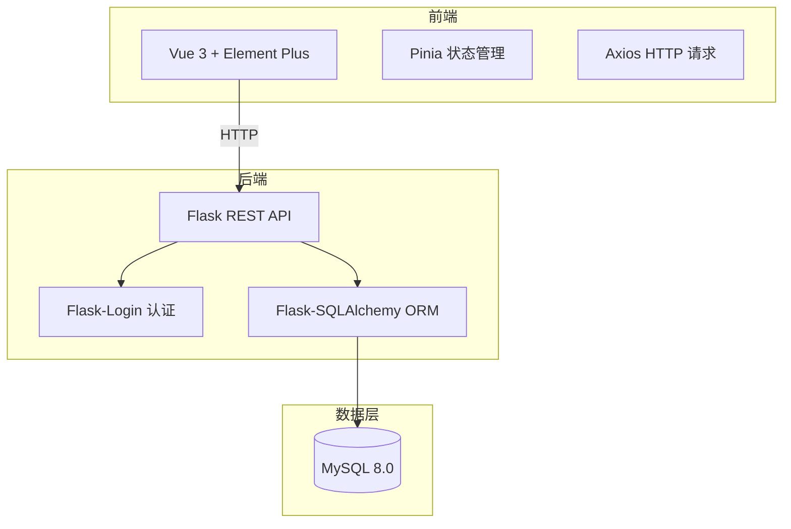
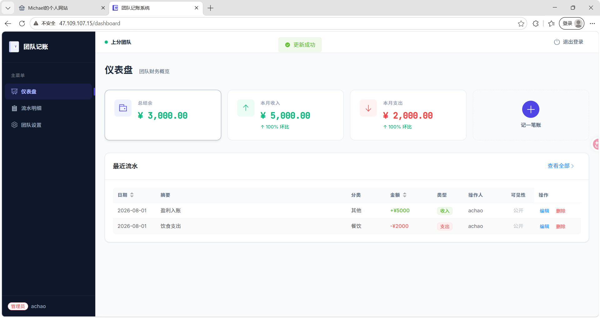
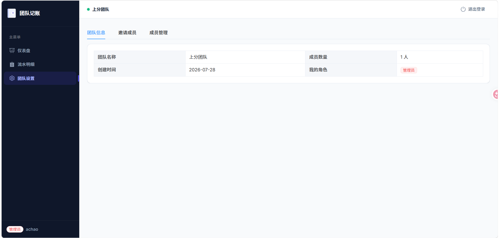
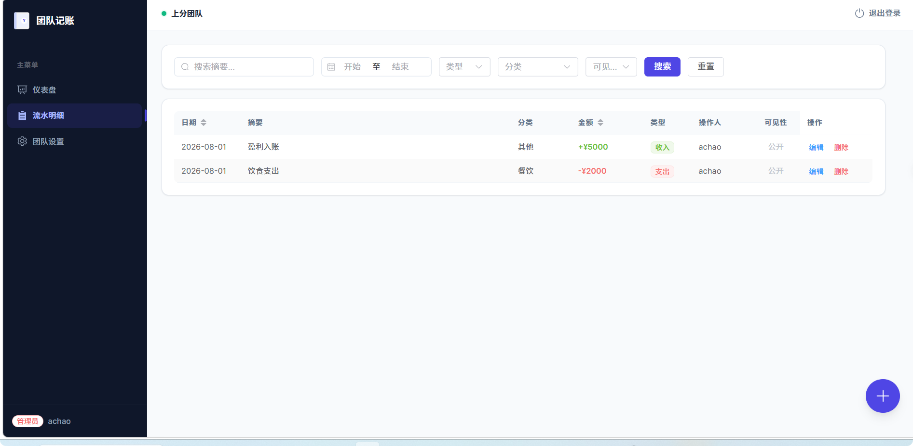
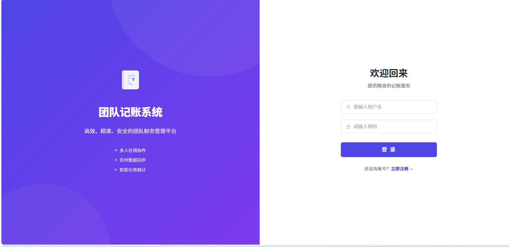

## 一、项目概览

这是一个**团队协作记账 Web 应用**，面向小组、宿舍、家庭等小团队场景。每个用户可以创建或加入一个团队，在团队内部记录收支账单，管理员可以管理成员、查看全队财务数据。



> 💡 **关于 AI 辅助开发**：这个项目同样借助了 AI 编程助手。Element Plus 的组件 API、Flask 的蓝图（Blueprint）架构、SQLAlchemy 的关联查询，这些我一开始都不熟，但在 AI 的帮助下逐步搭建完成。后面会穿插分享具体的使用心得。

---

## 二、技术栈详解

### 2.1 Vue 3 + Element Plus —— 前端界面

**Vue 3 是什么**：一个前端框架，用组件化的方式构建网页交互界面。

**Element Plus 是什么**：一套基于 Vue 3 的 UI 组件库，提供了现成的按钮、表格、对话框、日期选择器、标签页等组件，开箱即用，风格统一。

**在这个项目里干了什么**：
- Vue 3 负责整体页面结构、路由跳转、数据绑定
- Element Plus 提供了几乎所有 UI 元素——账单表格（`el-table`）、统计卡片（`el-card`）、记账对话框（`el-dialog`）、日期筛选器（`el-date-picker`）、设置页的标签页（`el-tabs`）等等
- 仪表盘的四张统计卡片（总结余、本月收入、本月支出、"记一笔"按钮）都是 `el-card` 组件，配合 `el-row` / `el-col` 栅格系统实现响应式布局

> Element Plus 的组件有几十种，每个都有很多属性（props）和事件（events）。我不可能全记住。实际工作流是：描述需求（比如"我要一个带搜索、分页、排序的表格"），AI 直接给出完整的 `<el-table>` 代码和对应的 `data` / `methods`。遇到组件行为不符合预期时，把代码贴给 AI，它通常能很快定位是哪个属性配错了。

### 2.2 Pinia —— 状态管理

**它是什么**：Vue 3 生态中的状态管理库，相当于一个全局的数据仓库。

**在这个项目里干了什么**：
- **认证状态**（`auth store`）：存储当前用户信息、登录状态、角色（admin/member）
- **团队状态**（`team store`）：当前团队信息、成员列表、邀请码
- **账单状态**（`bill store`）：账单列表、筛选条件、分类数据

当用户在账单页面筛选"支出 + 餐饮分类"时，筛选条件存入 bill store，表格自动刷新数据——这就是状态管理的价值。

### 2.3 Flask + 蓝图架构 —— 后端 API

**Flask 是什么**：轻量级 Python Web 框架，适合构建 RESTful API。

**蓝图（Blueprint）是什么**：Flask 的模块化机制。可以把不同功能（认证、账单、团队）拆分到不同的蓝图文件中，每个蓝图独立注册路由，代码结构清晰。

**在这个项目里干了什么**：

| 蓝图 | 路由前缀 | 职责 |
|------|---------|------|
| `auth_bp` | `/api/books/auth/` | 注册、登录、登出、获取当前用户 |
| `teams_bp` | `/api/books/teams/` | 创建团队、通过邀请码加入、获取团队信息、成员管理 |
| `bills_bp` | `/api/books/bills/` | 账单 CRUD、筛选搜索、分类列表、数据统计 |

**服务层（Service Layer）**：业务逻辑没有直接写在路由函数里，而是抽到 `services/` 目录。路由只负责接收请求 → 调 service 函数 → 返回响应。这让代码更好测试和维护。

> 蓝图架构一开始我是完全不懂的——一个 `app.py` 写到底不行吗？AI 帮我解释了蓝图的好处：当项目有十几个 API 端点时，全堆在一个文件里会非常难维护。然后帮我生成了蓝图的注册代码框架，我只需要在对应的蓝图文件里填路由函数。

### 2.4 Flask-Login + bcrypt —— 用户认证

**Flask-Login 是什么**：Flask 的登录管理扩展，处理"记住用户登录状态"这件事。

**在这个项目里干了什么**：
- 用户登录后，Flask-Login 在服务端 Session 中存储用户 ID
- 后续请求自动识别用户身份（通过 `current_user` 全局变量）
- `@login_required` 装饰器保护所有需要登录的接口
- 密码用 `bcrypt` 哈希存储，不存明文

### 2.5 SQLAlchemy + MySQL —— 数据持久化

**SQLAlchemy 是什么**：Python 的 ORM（对象关系映射）框架。简单说，就是把数据库表映射成 Python 类，操作数据库就像操作 Python 对象。

**在这个项目里干了什么**：

项目设计了 3 张核心表：

| 表 | 关键字段 | 说明 |
|----|---------|------|
| `users` | id, username, email, password_hash, role, team_id | 用户，支持 admin / member 两种角色 |
| `teams` | id, name, invite_code | 团队，通过 8 位邀请码加入 |
| `bills` | id, amount, type, category, date, summary, visibility, user_id, team_id | 账单，支持公开/私密两种可见性 |

**关系设计**：一个用户属于一个团队（多对一），一个团队有多条账单（一对多），每条账单关联一个记账人。通过 SQLAlchemy 的 `relationship` 和 `ForeignKey` 定义关联，查询时可以一次性加载关联数据（`joinedload`），避免 N+1 查询问题。

---

## 三、核心功能实现

### 3.1 团队与权限系统

每个用户注册后需要**创建团队**或**通过邀请码加入团队**。团队内部区分两种角色：

- **管理员（admin）**：可以增删改所有账单、查看全队财务统计、管理成员（踢人）、查看邀请码
- **普通成员（member）**：只能添加账单、查看公开账单、查看自己的统计

权限控制通过自定义装饰器实现：

```python
# 管理员专属接口
@bills_bp.route('/<int:bill_id>', methods=['DELETE'])
@admin_required    # 只有 admin 角色能调用
@team_required     # 必须在团队中
def delete(bill_id):
    ...
```

### 3.2 账单管理

**添加账单**：点击仪表盘"记一笔"按钮，弹出对话框，填写金额、类型（收入/支出）、分类、日期、摘要，可选择公开或私密。

**账单列表**：支持多维度筛选——关键词搜索摘要、日期范围、收支类型、分类下拉。表格默认按日期 + 创建时间倒序排列。

**编辑与删除**：管理员可以编辑任意账单或删除。删除有二次确认弹窗，防止误操作。

### 3.3 隐私设计

账单支持**公开（public）**与**私密（private）**两种可见性。普通成员只能看到团队中公开的账单，管理员可以看到全部。这在合租记账场景中很实用——比如买私人物品的开支可以设为私密，公共开销设为公开。

筛选逻辑在服务层实现：

```python
# 普通成员自动过滤掉 private 账单
if user_role != 'admin':
    query = query.filter_by(visibility='public')
```

### 3.4 数据统计

仪表盘顶部展示四个指标：

| 指标 | 说明 |
|------|------|
| 总结余 | 所有历史收入 - 所有历史支出 |
| 本月收入 | 当月收入合计 |
| 本月支出 | 当月支出合计 |
| 环比变化 | 与上月的百分比变化，涨红跌绿 |

统计使用 SQLAlchemy 的聚合函数（`SUM`）和日期范围查询实现。环比计算通过对比当月与上月数据得出。

### 3.5 自定义账单分类

项目预设了常用分类：收入类（工资、奖金、兼职、投资、报销等）、支出类（餐饮、交通、购物、娱乐、住房等）。用户也可以添加自定义分类，以 `custom:` 前缀标识存储。

---

## 四、安全设计

- **密码安全**：bcrypt 哈希存储，不存明文
- **认证保护**：`@login_required` 装饰器保护所有需登录接口
- **角色鉴权**：`@admin_required` 确保只有管理员能删除账单、管理成员
- **团队隔离**：`@team_required` 确保用户已加入团队；所有账单查询带 `team_id` 过滤，不会跨团队泄露数据
- **隐私过滤**：普通成员只能看到公开账单
- **SQL 注入防护**：全部使用 SQLAlchemy ORM 参数化查询
- **凭证安全**：数据库密码通过 `.env` 环境变量注入，已加入 `.gitignore`

---

## 五、部署方案

项目支持 Docker Compose 一键部署：

```yaml
services:
  mysql:    # MySQL 8.0，端口映射 3307
  backend:  # Flask + Gunicorn，端口 5000
  frontend: # Nginx 反代 + Vue 静态文件，端口 80
```

Nginx 作为统一入口，`/api/` 代理到 Flask 后端，其余请求走 Vue 前端（history 模式）。部署脚本 `deploy.sh` 支持从零开始：安装 Docker → 克隆代码 → 配置环境变量 → 构建容器 → 数据库迁移 → 上线。

---

## 六、效果展示

### 仪表盘
- 四张统计卡片横向排列：总结余、本月收入、本月支出、"记一笔"快捷按钮
- 下方展示最近 5 条流水，点击可查看全部
- 收入金额绿色显示，支出金额红色显示，一目了然

### 账单管理
- 搜索栏支持关键词、日期范围、收支类型、分类多维度筛选
- 表格展示账单明细，管理员可编辑或删除任意记录

### 团队设置
- "团队信息"页签：展示团队名、成员数、我的角色
- "邀请成员"页签（管理员）：显示 8 位邀请码，可一键复制
- "成员管理"页签（管理员）：查看成员列表，可移除成员

### 实际截图









---

## 七、写在最后：AI 辅助编程心得

这个项目和 Chatting Webpage 一样，使用了 AI 编程助手。分享几个印象深刻的场景：

**1. Element Plus 组件速查**：UI 组件库的 API 文档往往很长，找一个特定属性可能翻半天。直接问 AI "el-table 怎么自定义列排序"、"el-date-picker 怎么限制可选日期范围"，几秒就能得到带代码示例的答案。

**2. 后端架构设计**：Flask 的蓝图（Blueprint）和服务层（Service Layer）的架构是 AI 建议的。一开始我觉得一个文件写完所有 API 更省事，但 AI 解释了模块化的好处——当路由文件超过 200 行时，找代码和改代码都会变得痛苦。

**3. 错误排查**：前端 axios 请求报 CORS 跨域错误，AI 帮我定位到 Flask-CORS 的配置问题；SQLAlchemy 的关联查询返回 None，AI 指出是因为没有用 `joinedload` 预加载关联数据。

如果你也是从课堂 demo 往完整项目跨越的新手，AI 编程助手是一个非常好的"加速器"——帮你跳过照搬文档的低效时间，把精力花在理解架构和业务逻辑上。

---

📌 **项目公网地址**：[http://47.109.107.15](http://47.109.107.15)

📦 **项目仓库**：即将上线，敬请期待！

> 如果觉得有帮助，欢迎 Star ⭐
