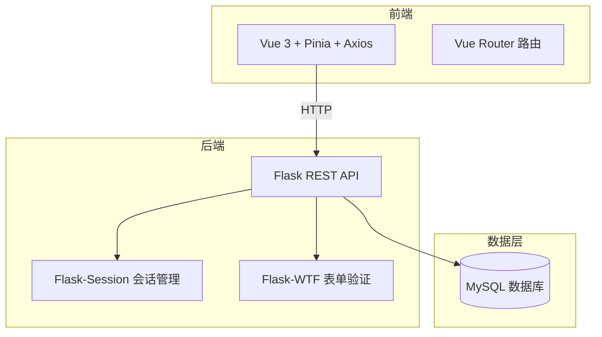

## 一、项目概览

这是一个**仿电商交易平台**，模拟了从商品浏览 → 加入购物车 → 下单的完整交易流程。数据库预置了 480 件商品，涵盖 8 个大类、24 个子分类，可以当作一个小型在线商城来体验。

> 在完成这个交易系统的过程中，AI 给了我很大的帮助，尤其是在数据库表结构设计和前后端联调方面。

---

## 二、技术栈详解

### 2.1 Vue 3 + Pinia + Vue Router —— 前端三件套

**Vue 3 的作用**：搭建整个前端界面——首页的商品网格、分类侧边栏、购物车页面、订单列表、商品详情页等等。每个页面都是一个独立的 Vue 组件。

**Vue Router 的作用**：管理页面之间的跳转。比如从首页点击商品 → 跳转到商品详情页 `/product/123`，从导航栏进入购物车 → `/cart`。URL 变化时，Vue Router 自动切换对应的页面组件，不需要刷新浏览器。

**Pinia 的作用**：管理全局共享的数据。比如用户登录状态（`authStore`）、分类数据（从后端获取后缓存起来，不用每次切换页面都重新请求）。

### 2.2 Axios —— 前后端通信的桥梁

**它是什么**：一个 HTTP 请求库，前端通过它向后端发送请求、接收数据。

**在这个项目里干了什么**：所有前后端数据交互都通过 Axios 完成——获取商品列表、搜索商品、添加到购物车、提交订单、查询订单历史……前端的每个操作最终都会通过 Axios 发一个 HTTP 请求到 Flask 后端。Axios 还帮我们统一配置了请求路径前缀（`/api/deals/`），避免了每个请求都写完整 URL。

### 2.3 Flask + Flask-Session —— 后端的核心

**Flask 的作用**：提供 RESTful API，处理所有业务逻辑。整个后端按功能拆分成了多个模块——商品 API、购物车 API、订单 API、分类 API、认证 API、首页 API，每个模块独立管理自己的路由。

**Flask-Session 的作用**：管理用户登录状态。用户登录后，服务端创建一个 Session 存在服务端，浏览器只保存一个 Session ID 的 Cookie。之后每次请求服务端通过 Session ID 识别用户身份，不需要每次请求都重新输入密码。

**Flask-WTF 的作用**：验证表单数据。比如注册时校验用户名不能为空、密码长度要够、邮箱格式要正确。这些校验规则在服务端再跑一遍，防止绕过前端验证直接发请求。

### 2.4 数据库设计 —— 5 张核心表

整个电商系统的数据存储在 5 张核心表中：

| 表名 | 作用 | 通俗理解 |
|------|------|---------|
| `users` | 用户信息 | 注册的用户名、密码（哈希后存储）、邮箱 |
| `categories` | 商品分类 | 大类（如"电脑"）下面有子类（如"配件""办公"），分类可以嵌套 |
| `products` | 商品信息 | 商品名、价格、描述、图片、库存数量，每件商品属于一个子分类 |
| `carts` / `cart_items` | 购物车 | 每个用户有一个购物车，购物车里有多个商品项（哪个商品 + 买几件） |
| `orders` / `order_items` | 订单 | 用户从购物车下单后生成订单，包含订单总额、状态、订单中的商品明细 |

**分类的树形结构**：`categories` 表用了一个自引用的设计——每个分类有一个 `parent_id` 字段指向它的父分类。顶级分类的 `parent_id` 为空。这样就能表示"电脑 → 配件 → 键盘"这种层级关系。查询某个大类的商品时，会同时查它所有子分类下的商品。

**购物车与订单的关系**：用户把商品加入购物车（只是暂存），确认购买后从购物车生成订单（正式记录）。订单一旦生成，购物车就清空了。订单有状态流转：pending（待付款）→ paid（已付款）→ shipped（已发货）→ completed（已完成）。

### 2.5 种子数据 —— 让系统"有货可卖"

一个空的商城没法体验。项目写了一个 `seed_data.py` 脚本，一键往数据库插入 480 件商品数据，覆盖了手机、电脑、家电、服装、食品、美妆、运动、图书 8 个大类，每大类下有 3 个子分类，每个子分类 20 件商品。每件商品都有真实的中文名称、价格和描述。

### 2.6 图片服务 —— 商品和广告图

商品图片通过 Picsum（一个免费的占位图片服务）动态生成，广告位 Banner 图是后端生成的 SVG 矢量图（纯代码绘制，不用任何外部图片资源）。这样部署时不需要带大量图片文件。

---

## 三、核心功能实现

### 3.1 首页

首页是用户看到的第一屏，聚合了三个区域：

- **搜索栏**：顶部关键词搜索，输入后跳转到搜索结果页
- **广告位（Banner）**：轮播展示促销活动（618大促、新品首发、限时秒杀），点击可跳转搜索
- **分类侧边栏 + 商品网格**：左侧显示商品分类树，点击分类后右侧商品网格自动筛选；不选分类时默认显示推荐商品

### 3.2 商品浏览与搜索

商品列表支持分页（每页 20 件），按发布时间倒序排列。点击分类时，会自动包含该分类下所有子分类的商品。搜索功能通过数据库 `LIKE` 查询商品名和描述字段实现。

商品详情页展示：商品大图、名称、价格、描述、库存、购物车按钮。已登录用户可以点击"加入购物车"。

### 3.3 购物车

购物车是每个用户的私人暂存区，支持：
- 添加商品（可指定数量）
- 修改数量（加/减）
- 删除商品
- 实时计算总金额

购物车数据存在数据库里，换了设备登录也能看到。点击"结算"按钮后，购物车中的所有商品生成一张订单。

### 3.4 订单管理

订单页面按时间倒序展示所有历史订单，每张订单显示：订单号、下单时间、总金额、状态标签、商品明细列表。

订单状态使用不同颜色的标签区分：灰色（pending）、橙色（paid）、蓝色（shipped）、绿色（completed）、红色（cancelled）。

### 3.5 用户认证

注册/登录使用传统的 Session 机制。密码经 Werkzeug 哈希后存储，不存明文。需要登录才能使用的功能包括：购物车、下单、查看订单。未登录用户仍然可以浏览商品和搜索。

---

## 四、安全设计

- **密码安全**：Werkzeug `generate_password_hash` 哈希存储
- **Session 安全**：服务端存储，Cookie 仅保存 Session ID
- **越权防护**：购物车和订单的所有接口都校验 `session['user_id']`，确保用户只能操作自己的数据。使用 `@login_required` 装饰器统一拦截未登录请求
- **表单验证**：后端使用 Flask-WTF 独立校验，不信任前端传来的数据
- **SQL 注入防护**：全程 SQLAlchemy ORM 参数化查询

---

## 五、效果展示

### 首页
- 顶部搜索栏 + 轮播广告 Banner
- 左侧分类树（8 大类，点击展开子分类）
- 右侧商品卡片网格，每张卡片显示商品图、名称、价格

### 商品详情
- 商品大图、名称、价格、描述、库存信息
- "加入购物车"按钮（支持选择数量）

### 购物车
- 商品列表（图片、名称、单价、数量调整、小计）
- 底部合计金额 + "去结算"按钮

### 订单
- 订单卡片列表，显示订单号、时间、金额、状态
- 点击展开显示订单商品明细

---

📌 **项目公网地址**：[http://47.109.107.15:5000](http://47.109.107.15:5000)

📦 **项目仓库**：[Gitee - trading_system](https://gitee.com/a-chao-loves-writing/trading_system)

> 如果觉得有帮助，欢迎 Star ⭐
